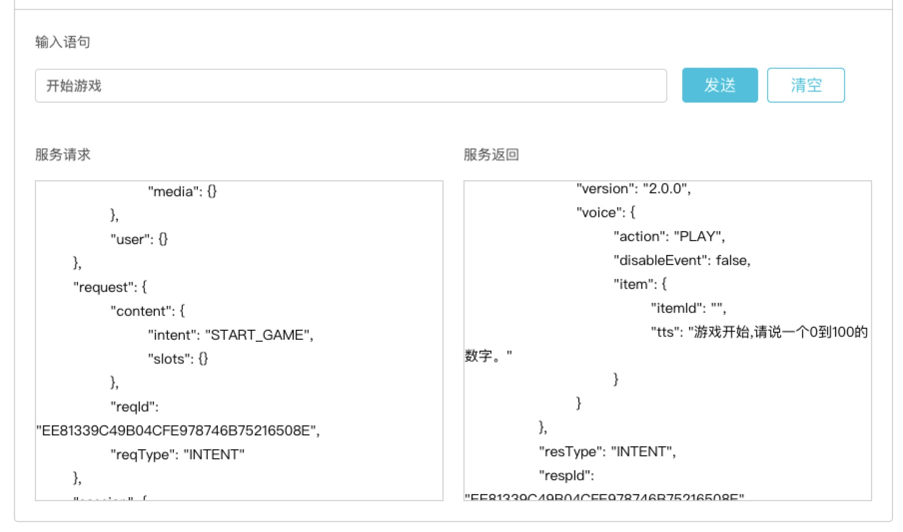

# SKILL JAVA SAMPLE - 猜数字
## 基础环境

* java version : 1.8+
* maven version : 3.0+

## 1.编译得到jar包

### 1.1 获取rokid-skill-sdk code
编译sdk

```bash
$ git clone https://github.com/Rokid/rokid-skill-sdk.git
$ cd rokid-skill-sdk/java/skill-kit
$ mvn -U clean install
```

### 1.2 获取猜数字(java版) code
编辑代码并生成可执行jar包

```bash
$ git clone https://github.com/Rokid/rokid-skill-sample.git
$ cd rokid-skill-sample/rokid-skill-sample-java-guessnumber
$ mvn -U clean install
```

## 2.获取SSL证书

详见：[通过Let’s Encrypt获取免费的SSL证书](https://developer-forum.rokid.com/t/lets-encrypt-ssl/175)

```bash
$ git clone https://github.com/Rokid/rokid-skill-tools.git
$ cd rokid-skill-tools
$ chmod +x generate-letsencrypt-certificate.sh
$ SKILL_DOMAIN=填写测试域名
$ ./generate-letsencrypt-certificate.sh $SKILL_DOMAIN
$ mv $SKILL_DOMAIN.crt ../test_domain.crt
$ mv $SKILL_DOMAIN.key ../test_domain.key
```

## 3.启动服务

```bash
$ java -jar /path/xxx.jar
```

**注** `/path/xxx.jar`为上面编译好的jar包

## 4.创建技能

了解更多详见：[开始开发Rokid技能](https://rokid.github.io/docs/1-GetStarted/rokid-skill-kit-introduction.html)

### 4.1 后端服务：

```bash
https://填写测试域名/
```

### 4.2 意图定义：

```json
{
	"intents": [
		{
			"intent": "START_GAME",
			"slots": [],
			"user_says": [
				"开始游戏"
			]
		},
		{
			"intent": "RE_START_GAME",
			"slots": [],
			"user_says": [
				"再玩一次",
				"继续游戏"
			]
		},
		{
			"intent": "GUESS_NUMBER",
			"slots": [
				{
					"name": "number",
					"type": "ROKID.NUMBER_ZH"
				}
			],
			"user_says": [
				"我猜$number"
			]
		}
	]
}
```


## 5.测试技能
在技能的「集成测试」页面，输入“开始游戏”，可以正常反馈“游戏开始，请说一个0到100的数字。”



